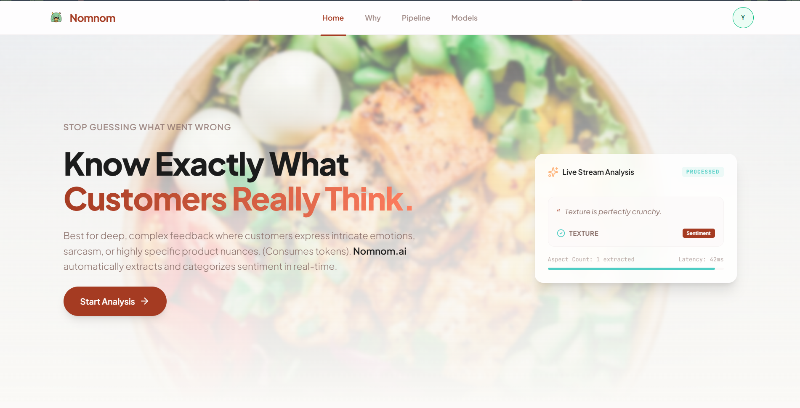
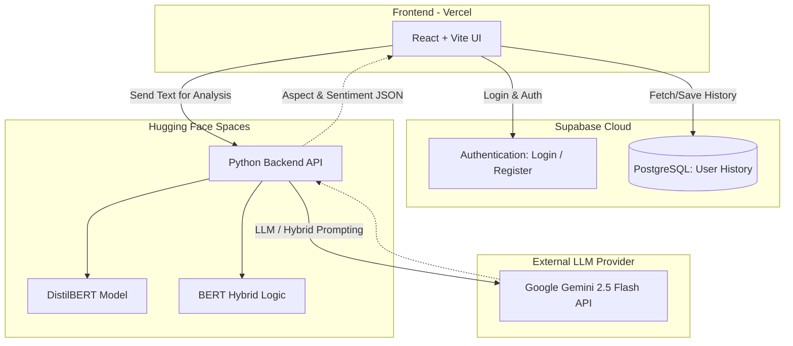

# 🦖 Nomnom AI — Aspect-Based Sentiment Analysis


> **A smart, modern web application for Aspect-Based Sentiment Analysis (ABSA) on food reviews. Nomnom AI goes beyond simple positive/negative scoring by extracting specific review aspects (e.g., taste, service, price) to provide actionable insights for F&B businesses.**
> _Built as a Natural Language Processing (NLP) university final project!_ 🚀
>
> **Status:** 🟢 Active (Currently in progress: Developing the Nomnom AI Browser Extension!)
>
> **🌟 Live Demo:** [**Nomnom AI Web App**](https://nomnomai.vercel.app/) | [**NLP Inference API**](https://huggingface.co/spaces/mpricillia/nomnom) | [**Frontend Source Code**](https://github.com/mpricillia/nomnom)

## 📖 Project Overview

Nomnom AI empowers restaurant owners and food reviewers by automating text processing to understand customer feedback deeply. Instead of just knowing if a review is good or bad, the system identifies _what_ exactly the customer is praising or complaining about. To achieve this, the platform offers three distinct AI inference engines: **DistilBERT**, a **Hybrid Model (Gemini 2.5 Flash + BERT)**, and a pure **LLM approach**.

## 🎥 Video Demonstration

[](https://drive.google.com/file/d/1_NkYqMv0026lT13AZFgi94WKxBkVbHlb/view?usp=drive_link)

*(Click the image above to watch the full demonstration)*

## ✨ Key Features

- **🎯 Aspect-Based Extraction:** Identifies specific aspects within a review (e.g., food quality, ambiance, customer service) alongside the sentiment, enabling targeted business improvements.
- **🤖 Triple AI Model Selection:**
  - **DistilBERT:** 100% free local inference using Hugging Face models.
  - **Hybrid Model:** Leverages Google Gemini 2.5 Flash combined with IndoBERT for advanced context understanding and batch processing.
  - **LLM:** Pure Large Language Model analysis for deep reasoning.
- **📊 Rich Dashboard & Smart Quota System:** Automated segmented credit policy with a visually pleasing capacity dashboard, usage history, and sentiment distribution charts.
- **🔒 Secure Local Sandbox:** API keys are stored securely in the browser's local storage. No sensitive API data is synced to the database.
- **🔑 Authentication:** Powered by Supabase Auth (Email & Password).



## 🤝 My Role & Contributions

In this collaborative group project, my primary responsibility was architecting the **Natural Language Processing Models and Backend API**. My specific contributions include:

- **NLP Model Engineering:** Researched, fine-tuned, and implemented the three core sentiment analysis engines (DistilBERT, the Hybrid BERT + Gemini pipeline, and the LLM prompt-engineering logic) to accurately extract sentiment polarity and specific review aspects.
- **Backend API Development:** Designed the Python-based backend architecture to serve the NLP models, exposing robust RESTful endpoints for the frontend to consume.
- **Hugging Face Deployment:** Packaged the heavy NLP inference engine and successfully deployed it to Hugging Face Spaces, ensuring seamless communication with the frontend application.

## 💻 Tech Stack

**Backend & AI Models (My Contribution - Hosted on Hugging Face)**

- **Python** 🐍 (Core Backend Language)
- **Hugging Face Transformers** 🤗 (DistilBERT implementations)
- **Google Gemini API** ✨ (`@google/genai` for LLM and Hybrid processing)

**Frontend & BaaS (Client)**

- **React 18 & TypeScript (Vite)** ⚛️
- **Tailwind CSS & Framer Motion** 🎨
- **Supabase** 🗄️ (PostgreSQL & Authentication)

## 📂 Project Structure

```text
 ┣ 📂 api               # (My Contribution) Backend API endpoints
 ┣ 📂 code              # (My Contribution) Model training & evaluation notebooks
 ┃ ┣ 📜 bert.ipynb      # DistilBERT training/evaluation
 ┃ ┣ 📜 hybrid.ipynb    # Hybrid model (BERT + Gemini) experiments
 ┃ ┣ 📜 llm.ipynb       # Pure LLM prompting experiments
 ┃ ┗ 📜 train_new.ipynb # Main training and fine-tuning scripts
 ┣ 📂 public            # Static assets (Logos, Icons, etc.)
 ┣ 📂 src               # React source code (Components, Hooks, Lib, App.tsx, main.tsx)
 ┣ 📜 .env.example      # Environment variable templates
 ┣ 📜 .gitattributes    # Git attributes configuration
 ┣ 📜 .gitignore        # Git ignore rules
 ┣ 📜 index.html        # Main HTML Template
 ┣ 📜 package-lock.json # Dependency lock file
 ┣ 📜 package.json      # Dependencies and Scripts
 ┣ 📜 README.md         # Project documentation
 ┣ 📜 server.ts         # Server configuration file
 ┣ 📜 tsconfig.json     # TypeScript configuration
 ┗ 📜 vite.config.ts    # Vite Configuration
```

## ⚙️ Running Locally

> **Note:** For security reasons, the `.env` file containing the production Supabase keys and API endpoints is not included in this repository. To run this locally, you must provide your own API keys or contact the author for a temporary testing environment.

1. Setup Environment Variables
   Create a .env file in the root directory and add your Supabase credentials:
   ```bash
   VITE_SUPABASE_URL=your_supabase_url
   VITE_SUPABASE_ANON_KEY=your_supabase_anon_key
   VITE_HF_API_URL=http://localhost:8000  # URL to your local backend API
   ```
2. Run Backend API (NLP Engine)
   Navigate to the api directory, install Python requirements, and run the server:
   ```bash
    cd api
    pip install -r requirements.txt
    uvicorn app:app --reload --port 8000
    ```

3. Run Frontend Development Server
   Open a new terminal, navigate to the project root, install Node dependencies, and start Vite:
   ```bash
    npm install
    npm run dev
    ```

## 🌐 Deployment Architecture

- Frontend (Vercel): The React client application is optimized and hosted on Vercel utilizing the Vite framework preset. Supabase credentials must be set in Vercel's Environment Variables[cite: 23].

- Backend (Hugging Face Spaces): The NLP inference API (DistilBERT and Hybrid processing logic) is deployed on Hugging Face Spaces to efficiently handle model computations.

- Database & Auth (Supabase): Acts as the Backend-as-a-Service (BaaS) to securely handle user authentication and store aspect-based review histories.

## 👨‍💻 Author

Yosuke Yung
CS Student @ BINUS UNIVERSITY